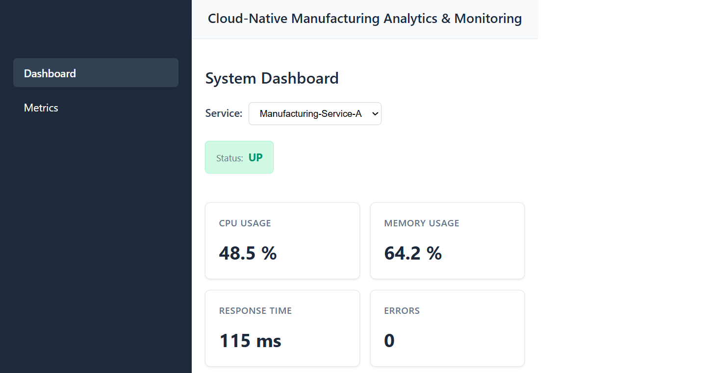
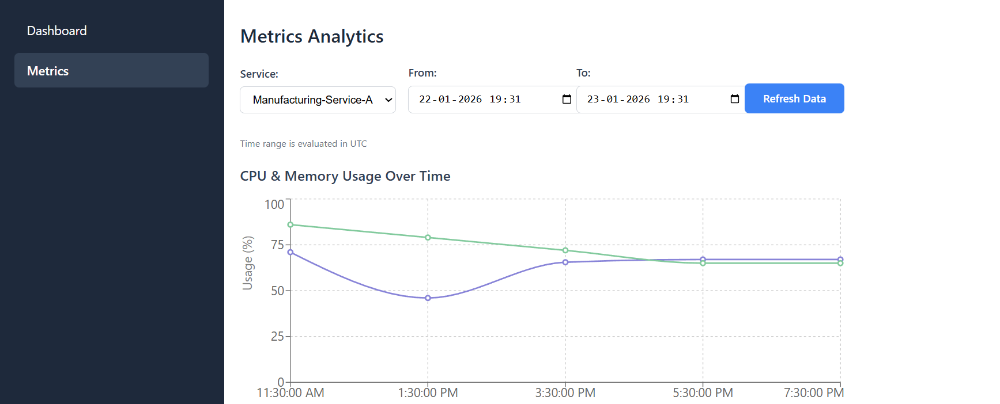
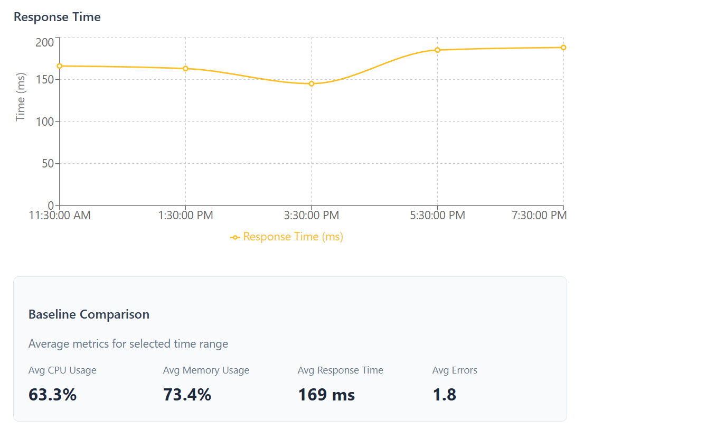

# Cloud-Native Manufacturing Analytics & Monitoring Platform

A full-stack monitoring platform for manufacturing systems that tracks service health metrics (CPU, memory, response time, errors) using time-series analytics and baseline performance comparison.

---

## Overview

This project demonstrates how large-scale manufacturing services can be monitored in real time.  
It provides dashboards for engineers to visualize current system health and analyze historical performance trends using baseline calculations.

The platform uses a hybrid database strategy:
- **SQL Server** for transactional data (users, roles, alert configurations)
- **MongoDB** for time-series metrics data

---

## Tech Stack

### Backend
- .NET 8 Web API  
- Entity Framework Core  
- SQL Server  
- MongoDB  
- Swagger / OpenAPI  

### Frontend
- React 18 + TypeScript  
- Vite  
- Axios  
- Recharts  
- React Router  

---

## Architecture

- Controllers → Services → Repositories → SQL Server  
- Controllers → Services → MongoDB (metrics)  
- Clean separation of concerns  
- Hybrid persistence for scalability and data integrity  

**Data Storage:**
- SQL Server: Users, Roles, AlertConfigurations  
- MongoDB: MetricDocuments (time-series data)  

---

## Features

- Real-time monitoring dashboard  
- CPU, memory, response time & error tracking  
- Time-series charts for historical analysis  
- Baseline performance calculations  
- Service-based filtering  
- Date range selection  
- Responsive UI  
- Global error handling & validation  

---

## API Endpoints

| Method | Endpoint | Description |
|--------|----------|-------------|
| POST | `/api/auth/login` | User login |
| GET | `/api/users` | Get users |
| POST | `/api/users` | Create user |
| GET | `/api/alerts` | Get alert configurations |
| POST | `/api/alerts/config` | Create alert |
| POST | `/api/metrics` | Insert new metric |
| GET | `/api/metrics/latest` | Latest metric by service |
| GET | `/api/metrics/history` | Metrics by time range |
| GET | `/api/metrics/baseline` | Baseline averages |

---

## Screenshots

### Dashboard



### Metrics Analytics



---

## Setup Instructions

### Prerequisites
- .NET 8 SDK  
- Node.js 18+  
- SQL Server Express  
- MongoDB  

---

### Backend Setup

```bash
cd ManufacturingMonitoring.API
dotnet restore
dotnet ef database update
dotnet run
```

Backend runs at: http://localhost:5006

Swagger: http://localhost:5006/swagger

### Frontend Setup

```bash
cd manufacturing-monitoring-dashboard
npm install
npm run dev
```

Frontend runs at: http://localhost:5173

---

## Future Enhancements

- JWT authentication & role-based access control
- SignalR real-time updates
- Alert notification system
- Azure deployment
- CI/CD pipeline
- Docker containerization

---

## Author

Vaibhav Kumar

---

## License

MIT License
